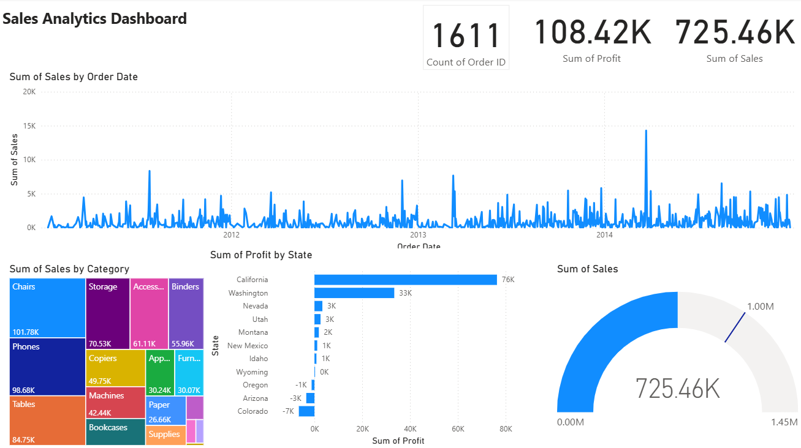

# 📈 Amazon Retail Sales Performance & Profitability Analysis

## 📌 Project Overview

This project focuses on analyzing sales data from a retail e-commerce business (Amazon-style dataset). The objective was to evaluate key business metrics such as **Total Sales, Profitability, Customer Trends, and Regional Performance** to uncover actionable insights and improve decision-making.

## 🛠️ Tech Stack

* **Data Source:** Excel Dataset (Superstore/Amazon Sales Data)
* **Tool:** Power BI Desktop
* **Data Cleaning:** Power Query
* **Modeling:** DAX (Data Analysis Expressions) for KPIs and calculated measures

## 📂 Data & Project Files
- **Raw Data:** [sales_data_raw.xlsx](./sales_data_raw.xlsx)
- **Power BI Dashboard:** [sales_performance_report.pbix](Sales Analytics Dashboard.pbix)

## 📊 Dashboard Preview

## 💡 Business Insights

* **Overall Performance:**
  The business generated strong revenue, but profit margins were inconsistent across categories, indicating inefficiencies in cost management.

* **Category Analysis:**

  * **Technology** emerged as the most profitable category.
  * **Furniture** showed high sales but **low or negative profit**, highlighting pricing or cost issues.

* **Sub-Category Insights:**

  * Products like **Chairs and Tables** contributed significantly to sales but were often loss-making.
  * **Phones and Accessories** delivered high profitability and consistent performance.

* **Regional Performance:**

  * The **West region** contributed the highest share of total sales.
  * The **Central region** showed comparatively lower profitability, indicating operational inefficiencies.

* **Customer Behavior:**

  * A small group of customers contributed disproportionately to total revenue (high-value customers).
  * Opportunity identified for **customer retention and loyalty programs**.

* **Time-Based Trends:**

  * Sales showed **seasonal spikes during Q4**, likely due to festive and holiday demand.
  * Month-over-Month trends indicated steady growth with occasional dips, suggesting scope for better demand forecasting.

## 🚀 Key Features

* Interactive dashboard with filters for **Region, Category, and Time**
* KPI cards for **Total Sales, Profit, Orders, and Profit Margin**
* Time-series analysis for tracking **monthly sales trends**
* Identification of **loss-making products and regions**
* Customer-level analysis to highlight **top-performing customers**

## 📌 Conclusion

This analysis highlights key areas where the business can improve profitability, such as optimizing pricing strategies for loss-making products and focusing on high-performing categories like Technology. The dashboard enables stakeholders to monitor performance and make data-driven decisions effectively.

